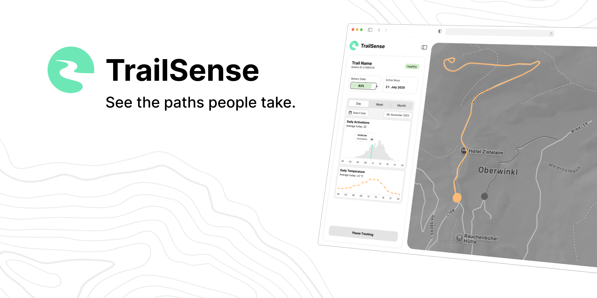

# TrailSense

TrailSense is an open-source tool for visualizing anonymous crowd and trail activity. It helps tourism boards, local authorities, and event organizers understand how hiking areas and outdoor spaces are used over time.

The system estimates crowd density by counting nearby Wi-Fi and Bluetooth Low Energy (BLE) signals and turns the aggregated data into heatmaps, without storing or transmitting any personal information.

It’s designed for use at trailheads and other outdoor starting points to provide insights into visitor flow and support better trail management and environmental planning.

## Features

- **Wi-Fi and BLE Detection**: Counts nearby anonymous device signals to estimate local activity levels.
- **Heatmap Visualization**: Creates visual maps of foot-traffic density to identify popular or congested areas.
- **Trail Mapping**: Displays hiking trails and highlights high-traffic zones.
- **Real-Time Monitoring**: Provides live updates on activity levels and sensor status.
- **Open Source**: Fully open source for transparency, customization, and community contributions.
- **Privacy-First Design**: Processes only anonymous, aggregated counts. No personal data, device identifiers, or tracking information are stored or transmitted.

## Further Information

For details about setup, implementation, and contributing, see the documentation:

- [Hardware Documentation](hardware/esp32/README.md)
- [Web Application Documentation](app/README.md)
- [Privacy Statement](PRIVACY.md)
